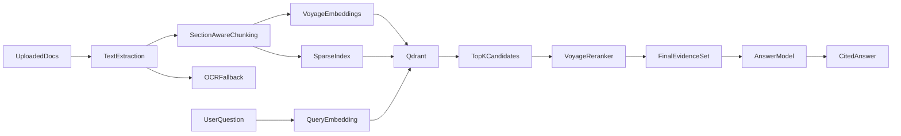

# AfCFTA RAG Provider Selection

## Goal

Add an AI assistant that can answer AfCFTA-related compliance questions from uploaded source documents with grounded, citation-first responses.

## Recommended Production Stack

- Vector database: `Qdrant`
- Dense embeddings: `Voyage voyage-4`
- Optional legal-heavy alternative: `Voyage voyage-law-2`
- Reranker: `Voyage rerank-2.5-lite`
- Answer model: `OpenAI GPT-5 mini`
- OCR fallback for scanned PDFs: `Mistral OCR`

## Why This Stack

- `Qdrant` is a strong fit for hybrid retrieval and starts cheaply.
- `Voyage` is unusually strong on multilingual retrieval and legal retrieval, which matters for AfCFTA, customs, tariff, and certificate-of-origin content.
- `rerank-2.5-lite` adds a meaningful precision boost at low cost.
- `GPT-5 mini` is cheap enough for production and materially safer than ultra-budget models for citation-grounded compliance answers.
- `Mistral OCR` is cost-effective for scanned or table-heavy policy documents, so OCR can stay a targeted fallback instead of a default cost center.

## Cheapest Viable Alternative

- Vector database: `Qdrant`
- Dense embeddings: `Voyage voyage-4-lite`
- Reranker: `Voyage rerank-2.5-lite`
- Answer model: `Gemini Flash-Lite`

This stack is attractive when answer volume is high and average question complexity is low, but it is more likely to underperform on nuanced compliance interpretation, exception handling, and answer formatting discipline.

## Higher-Quality Fallback

- Vector database: `Qdrant`
- Dense embeddings: `Voyage voyage-4`
- Reranker: `Voyage rerank-2.5`
- Answer model: `Claude Sonnet 4.6`

This is the quality-first fallback if accuracy on ambiguous or multi-document questions becomes more important than cost.

## Retrieval Architecture

## Recommended Retrieval Strategy

### 1. Hybrid retrieval

Use:

- Dense embeddings for semantic recall
- Sparse/BM25 search for article numbers, HS codes, tariff percentages, and exact phrases
- Metadata filters for jurisdiction, document type, language, date, and source

This matters because compliance questions often include exact identifiers that dense-only retrieval misses.

### 2. Reranking

Rerank the merged candidate set before sending evidence to the answer model.

Recommended baseline:

- Dense top-k: `40`
- Sparse top-k: `40`
- Fused set after dedupe: `40-60`
- Reranked final evidence: `6-10`

### 3. Chunking

Use section-aware chunking rather than raw fixed windows.

Recommended defaults:

- Target chunk size: `600-900` tokens
- Overlap: `80-150` tokens
- Never split article headings from their bodies if avoidable
- Preserve table titles, footnotes, annex names, and schedule labels in metadata

## Provider Comparison

| Layer | Best overall | Cheapest viable | Premium fallback | Notes |
| --- | --- | --- | --- | --- |
| Vector DB | `Qdrant` | `Qdrant` | `Qdrant` | Free starter path, strong hybrid search support |
| Embeddings | `Voyage voyage-4` | `Voyage voyage-4-lite` | `Voyage voyage-4` | Strong multilingual retrieval |
| Legal-heavy embeddings | `Voyage voyage-law-2` | `Voyage voyage-law-2` | `Voyage voyage-law-2` | Good if corpus is dominated by legal/regulatory text |
| Rerank | `Voyage rerank-2.5-lite` | `Voyage rerank-2.5-lite` | `Voyage rerank-2.5` | Lite is usually enough to start |
| Generation | `OpenAI GPT-5 mini` | `Gemini Flash-Lite` | `Claude Sonnet 4.6` | Trade-off is cost vs answer reliability |
| OCR | `Mistral OCR` | native extraction first | `Mistral OCR` | Use only when native PDF text is poor |

## Practical Cost View

Approximate reference pricing from public provider docs reviewed during research:

- `Qdrant Cloud`: free `1 GB` starter cluster, production managed plans start around `$25/month`
- `Voyage voyage-4`: about `$0.06 / 1M tokens`
- `Voyage voyage-4-lite`: about `$0.02 / 1M tokens`
- `Voyage rerank-2.5-lite`: about `$0.02 / 1M tokens processed`
- `OpenAI GPT-5 mini`: about `$0.25 / 1M input`, `$2.00 / 1M output`
- `Gemini Flash-Lite`: roughly in the ultra-low-cost generation tier, but check the currently GA variant before launch
- `Claude Sonnet 4.6`: about `$3 / 1M input`, `$15 / 1M output`
- `Mistral OCR`: about `$1-2 / 1,000 pages` depending on mode

## Cost-Effectiveness Ranking

### Best overall cost/performance

`Qdrant` + `Voyage voyage-4` + `Voyage rerank-2.5-lite` + `OpenAI GPT-5 mini`

Why:

- Retrieval quality stays strong
- Reranking is cheap enough to leave on
- Answer model cost is low enough for production
- Better answer discipline than the absolute cheapest generators

### Lowest cost

`Qdrant` + `Voyage voyage-4-lite` + `Voyage rerank-2.5-lite` + `Gemini Flash-Lite`

Why:

- Very low inference cost
- Good enough for straightforward retrieval-grounded answers

Risks:

- More brittle on ambiguous questions
- More likely to need prompt tightening for citation style and refusal behavior
- Preview-only model variants should be avoided for regulated production workflows

### Highest confidence

`Qdrant` + `Voyage voyage-4` + `Voyage rerank-2.5` + `Claude Sonnet 4.6`

Why:

- Strong reasoning quality
- Better at caveats, edge cases, and answer structure

Risks:

- Much higher cost

## Governance And Safety Requirements

The assistant should:

- answer only from retrieved evidence
- cite the exact source section or article where possible
- explicitly say when the uploaded documents do not contain enough evidence
- distinguish between treaty-level rules and country-specific implementation rules
- avoid giving definitive legal advice language
- log the retrieved chunks and citation IDs for auditability

## Minimum Metadata Schema For Qdrant

Store these fields on every chunk:

- `document_id`
- `document_title`
- `document_type`
- `jurisdiction`
- `country`
- `language`
- `article_or_section`
- `annex_or_schedule`
- `effective_date`
- `version`
- `source_url`
- `page_start`
- `page_end`
- `is_ocr`

## OCR Strategy

Use this order:

1. Native PDF text extraction
2. Quality check on extracted text
3. `Mistral OCR` only for scanned, low-quality, or table-heavy pages

This keeps ingestion cost low while still handling real-world regulatory PDFs.

## Final Recommendation

Ship the first production version with:

- `Qdrant`
- `Voyage voyage-4`
- `Voyage rerank-2.5-lite`
- `OpenAI GPT-5 mini`
- `Mistral OCR` only when needed

Keep one prepared downgrade path and one premium path:

- Cost-down path: switch generation to `Gemini Flash-Lite`, and if needed embeddings to `voyage-4-lite`
- Quality-up path: switch generation to `Claude Sonnet 4.6`

## Rollout Order

1. Launch retrieval with citations and strict refusal rules
2. Measure answer quality on the AfCFTA evaluation set in `docs/afcfta-rag-eval-set.json`
3. Compare the default and cheapest stacks using the scorecard in `docs/afcfta-rag-pilot-scorecard.md`
4. Promote the cheapest stack only if it preserves citation accuracy and multilingual reliability
